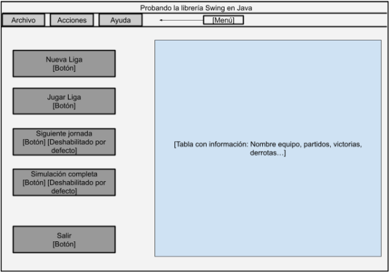

# Ejercicios semana 20 PROGRAMACIÓN: librería Swing

Se solicita realizar la siguiente interfaz gráfica utilizando la librería Swing de
Java. Es recomendable buscar información utilizando la documentación
propia de Java o la [página sugerida con información sobre los componentes
de Swing](https://web.mit.edu/6.005/www/sp14/psets/ps4/java-6-tutorial/components.html).

Nótese que las indicaciones están en corchetes, indicando que tipo de
elemento es. Se da por hecho que la ventana tiene los controles de cierre.
Especificaciones:
- La ventana debe tener un tamaño de 1600 píxeles de ancho y 900
  píxeles de alto. No se debe permitir la redimensión de la ventana.
- Los botones “Siguiente jornada” y “Simulación completa” deben estar
  deshabilitados por defecto.
- Los botones superiores son botones de “Menú”.
- El gran panel informativo será de tipo “Tabla” con la información de
  una liga de cualquier deporte o clasificación.